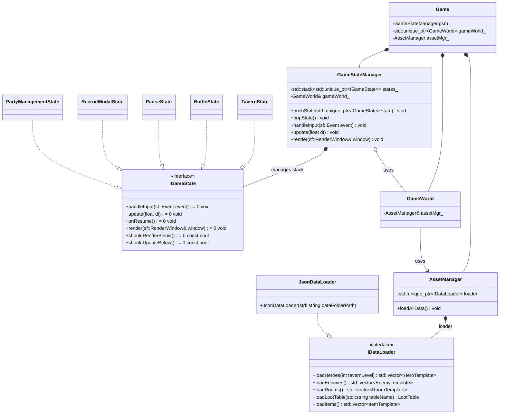

---
config:
  layout: elk
  theme: dark
title: High Level Architecture (Game / States)
---

## Архитектура верхнего уровня

Ниже — упрощённая UML (Mermaid) диаграмма верхнего уровня. Цель: **явно показать, что `GameStateManager` управляет переключением состояний** (стек `IGameState`, `pushState()`/`popState()`), а `Game` владеет основными подсистемами.

## Как читать диаграмму

- **Переключение состояний**: `GameStateManager` **владеет стеком** `states_ : stack<unique_ptr<IGameState>>` и делает `pushState()`/`popState()`. Активное состояние — вершина стека.
- **Жизненный цикл**: `GameStateManager` проксирует события/кадры в текущее состояние через `handleInput()`/`update()`/`render()`.
- **Владение данными**: `Game` владеет `GameWorld` и `AssetManager`, а `GameWorld` использует `AssetManager` по ссылке (`AssetManager&`).
- **Загрузка данных**: `AssetManager` работает через абстракцию `IDataLoader`; конкретная реализация — `JsonDataLoader`.

